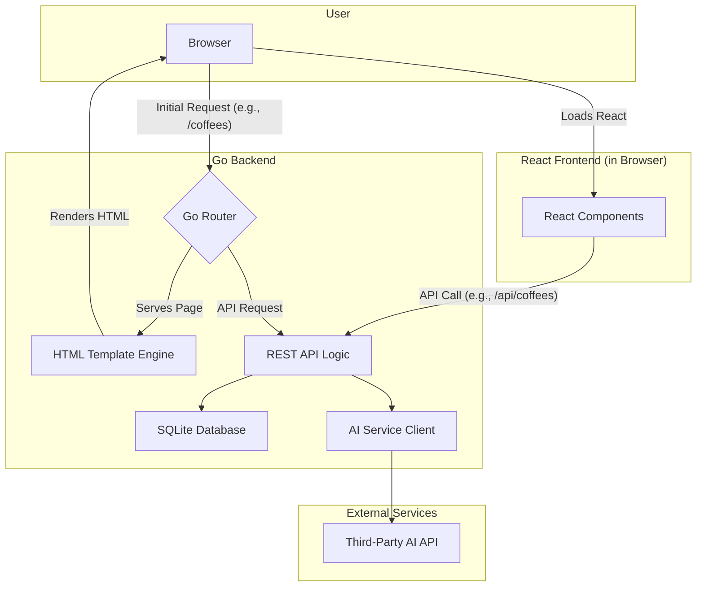

# The Coffee Companion Fullstack Architecture Document

## Introduction

This document outlines the complete fullstack architecture for The Coffee Companion, including backend systems, frontend implementation, and their integration. It serves as the single source of truth for AI-driven development, ensuring consistency across the entire technology stack.

This unified approach combines what would traditionally be separate backend and frontend architecture documents, streamlining the development process for modern fullstack applications where these concerns are increasingly intertwined.

### Starter Template or Existing Project
N/A - Greenfield project

### Change Log
| Date | Version | Description | Author |
|---|---|---|---|

---

## High Level Architecture

### Technical Summary

The architecture for the Coffee Companion app is designed to place most of the complexity on the backend, allowing you to focus on developing your Go skills. We will build a robust, monolithic backend with Go that not only serves a REST API but also handles routing and serves the initial HTML pages. The frontend will be a client-side React application that "hydrates" the server-rendered HTML, managing interactive components without the complexity of a full-blown single-page application's routing and data-fetching logic. This backend-driven approach will provide a solid foundation for the MVP while aligning with your learning goals.

### Repository Structure

We will use a **Monorepo** structure to keep the frontend and backend code together.

*   **Structure:** Monorepo
*   **Monorepo Tool:** `npm workspaces`. This is a simple, built-in solution that is perfect for our needs.
*   **Package Organization:**
    *   `apps/frontend`: The React application.
    *   `apps/backend`: The Go application, which will contain all API logic, routing, and HTML template rendering.
    *   `packages/shared-types`: Shared TypeScript types to ensure consistency between the frontend and backend.

### High Level Architecture Diagram

### Architectural Patterns

*   **Backend-Driven Frontend:** The Go backend will be responsible for routing and serving the initial HTML structure.
    *   *Rationale:* This simplifies the frontend, removing the need for complex client-side routing and data-fetching logic, and allows you to focus on building features in Go.
*   **Monolithic Architecture:** The backend will be a single, unified application.
    *   *Rationale:* This is the simplest and fastest approach for an MVP.
*   **Component-Based UI (with Hydration):** The React frontend will be used to create interactive components that "hydrate" the server-rendered HTML.
    *   *Rationale:* This gives us the benefit of React's component model for building a modern UI, without the complexity of a full single-page application.
*   **Repository Pattern:** The backend will use the repository pattern to abstract data access logic.
    *   *Rationale:* This will keep your business logic clean and make it easier to test and maintain.

---
## Tech Stack

### Technology Stack Table
| Category | Technology | Version | Purpose | Rationale |
|---|---|---|---|---|
| Frontend Language | TypeScript | latest | Type safety for the frontend application. | Catches errors early, improves code quality and maintainability. |
| Frontend Framework | React | 18.x | Building the user interface with components. | Modern, popular, and suitable for component-based UI with hydration. |
| UI Component Library | Material-UI (MUI) | latest | Pre-built UI components for faster development. | Provides a wide range of high-quality components that follow Material Design principles. |
| State Management | React Context | 18.x | Managing simple global state. | Built-in to React, sufficient for the MVP's needs without adding external dependencies. |
| Backend Language | Go | 1.22.x | The core backend language. | As specified in the high-level architecture, it's a performant language suitable for building a robust backend. |
| Backend Framework | Standard Library (`net/http`) | 1.22.x | Building the web server and REST API. | The standard library is powerful enough for our needs and avoids external dependencies for the core server. We can add specific libraries like `gorilla/mux` if needed for more complex routing. |
| API Style | REST | | Communication between frontend and backend. | A standard and well-understood API style. |
| Database | SQLite | 3.x | The application database. | Simple, file-based, and sufficient for the MVP. Easy to set up and manage. |
| Cache | N/A | | Not needed for MVP. | |
| File Storage | N/A | | Not needed for MVP. | |
| Authentication | N/A | | Not needed for MVP. | |
| Frontend Testing | Jest & React Testing Library | latest | Unit and component testing for the frontend. | Industry standard for testing React applications. |
| Backend Testing | Go standard library (`testing`) | 1.22.x | Unit and integration testing for the backend. | Built-in testing capabilities are sufficient for our needs. |
| E2E Testing | Playwright | latest | End-to-end testing for the entire application. | A modern and powerful E2E testing framework that supports multiple browsers. |
| Build Tool | `go build` | 1.22.x | Building the Go backend. | Standard Go build tool. |
| Bundler | Vite | latest | Bundling the frontend assets. | Fast, modern, and provides a great developer experience. |
| IaC Tool | N/A | | Not needed for MVP. | |
| CI/CD | GitHub Actions | | Continuous integration and deployment. | Integrated with our source control and easy to set up. |
| Monitoring | N/A | | Not needed for MVP. | |
| Logging | Go standard library (`log`) | 1.22.x | Logging for the backend. | Sufficient for our MVP needs. |
| CSS Framework | Emotion | latest | CSS-in-JS styling for React components. | Co-locates styles with components, making them more maintainable and reusable. Works well with Material-UI. |

---
## Data Models

---
## API Specification

---
## Components

---
## External APIs

---
## Core Workflows

---
## Database Schema

---
## Frontend Architecture

---
## Backend Architecture

---
## Unified Project Structure

---
## Development Workflow

---
## Deployment Architecture

---
## Security and Performance

---
## Testing Strategy

---
## Coding Standards

---
## Error Handling Strategy

---
## Monitoring and Observability

---
## Checklist Results Report
