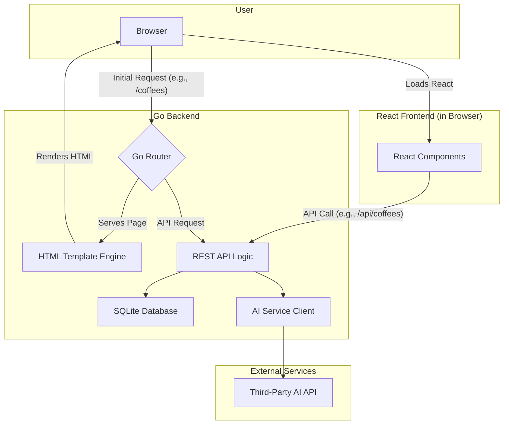

# The Coffee Companion Fullstack Architecture Document

## Introduction

This document outlines the complete fullstack architecture for The Coffee Companion, including backend systems, frontend implementation, and their integration. It serves as the single source of truth for AI-driven development, ensuring consistency across the entire technology stack.

This unified approach combines what would traditionally be separate backend and frontend architecture documents, streamlining the development process for modern fullstack applications where these concerns are increasingly intertwined.

### Starter Template or Existing Project
N/A - Greenfield project

### Change Log
| Date | Version | Description | Author |
|---|---|---|---|

---

## High Level Architecture

### Technical Summary

The architecture for the Coffee Companion app is designed to place most of the complexity on the backend, allowing you to focus on developing your Go skills. We will build a robust, monolithic backend with Go that not only serves a REST API but also handles routing and serves the initial HTML pages. The frontend will be a client-side React application that "hydrates" the server-rendered HTML, managing interactive components without the complexity of a full-blown single-page application's routing and data-fetching logic. This backend-driven approach will provide a solid foundation for the MVP while aligning with your learning goals.

### Repository Structure

We will use a **Monorepo** structure to keep the frontend and backend code together.

*   **Structure:** Monorepo
*   **Monorepo Tool:** `npm workspaces`. This is a simple, built-in solution that is perfect for our needs.
*   **Package Organization:**
    *   `apps/frontend`: The React application.
    *   `apps/backend`: The Go application, which will contain all API logic, routing, and HTML template rendering.
    *   `packages/shared-types`: Shared TypeScript types to ensure consistency between the frontend and backend.

### High Level Architecture Diagram

### Architectural Patterns

*   **Backend-Driven Frontend:** The Go backend will be responsible for routing and serving the initial HTML structure.
    *   *Rationale:* This simplifies the frontend, removing the need for complex client-side routing and data-fetching logic, and allows you to focus on building features in Go.
*   **Monolithic Architecture:** The backend will be a single, unified application.
    *   *Rationale:* This is the simplest and fastest approach for an MVP.
*   **Component-Based UI (with Hydration):** The React frontend will be used to create interactive components that "hydrate" the server-rendered HTML.
    *   *Rationale:* This gives us the benefit of React's component model for building a modern UI, without the complexity of a full single-page application.
*   **Repository Pattern:** The backend will use the repository pattern to abstract data access logic.
    *   *Rationale:* This will keep your business logic clean and make it easier to test and maintain.

---
## Tech Stack

### Technology Stack Table
| Category | Technology | Version | Purpose | Rationale |
|---|---|---|---|---|
| Frontend Language | TypeScript | latest | Type safety for the frontend application. | Catches errors early, improves code quality and maintainability. |
| Frontend Framework | React | 18.x | Building the user interface with components. | Modern, popular, and suitable for component-based UI with hydration. |
| UI Component Library | Material-UI (MUI) | latest | Pre-built UI components for faster development. | Provides a wide range of high-quality components that follow Material Design principles. |
| State Management | React Context | 18.x | Managing simple global state. | Built-in to React, sufficient for the MVP's needs without adding external dependencies. |
| Backend Language | Go | 1.22.x | The core backend language. | As specified in the high-level architecture, it's a performant language suitable for building a robust backend. |
| Backend Framework | Standard Library (`net/http`) | 1.22.x | Building the web server and REST API. | The standard library is powerful enough for our needs and avoids external dependencies for the core server. We can add specific libraries like `gorilla/mux` if needed for more complex routing. |
| API Style | REST | | Communication between frontend and backend. | A standard and well-understood API style. |
| Database | SQLite | 3.x | The application database. | Simple, file-based, and sufficient for the MVP. Easy to set up and manage. |
| Cache | N/A | | Not needed for MVP. | |
| File Storage | N/A | | Not needed for MVP. | |
| Authentication | N/A | | Not needed for MVP. | |
| Frontend Testing | Jest & React Testing Library | latest | Unit and component testing for the frontend. | Industry standard for testing React applications. |
| Backend Testing | Go standard library (`testing`) | 1.22.x | Unit and integration testing for the backend. | Built-in testing capabilities are sufficient for our needs. |
| E2E Testing | Playwright | latest | End-to-end testing for the entire application. | A modern and powerful E2E testing framework that supports multiple browsers. |
| Build Tool | `go build` | 1.22.x | Building the Go backend. | Standard Go build tool. |
| Bundler | Vite | latest | Bundling the frontend assets. | Fast, modern, and provides a great developer experience. |
| IaC Tool | N/A | | Not needed for MVP. | |
| CI/CD | GitHub Actions | | Continuous integration and deployment. | Integrated with our source control and easy to set up. |
| Monitoring | N/A | | Not needed for MVP. | |
| Logging | Go standard library (`log`) | 1.22.x | Logging for the backend. | Sufficient for our MVP needs. |
| CSS Framework | Emotion | latest | CSS-in-JS styling for React components. | Co-locates styles with components, making them more maintainable and reusable. Works well with Material-UI. |

---
## Data Models

Below are the primary data models for the application.

#### User Model
| Field | Type | Description | Constraints |
|---|---|---|---|
| `ID` | `int64` | Unique identifier for the user. | Primary Key, Auto-increment |
| `Username` | `string` | User's chosen username. | Required, Unique |
| `Email` | `string` | User's email address. | Required, Unique |
| `PasswordHash` | `string` | Hashed password for authentication. | Required |
| `PasswordSalt` | `string` | Salt used for password hashing. | Required |
| `CreatedAt` | `datetime` | Timestamp of user creation. | Required |
| `UpdatedAt` | `datetime` | Timestamp of last user update. | Required |

#### Coffee Model
| Field | Type | Description | Constraints |
|---|---|---|---|
| `ID` | `int64` | Unique identifier for the coffee. | Primary Key, Auto-increment |
| `Name` | `string` | The name of the coffee. | Required, Unique (per roaster) |
| `Origin` | `string` | The origin country or region of the beans. | Optional |
| `Roaster` | `string` | The company that roasted the coffee. | Optional |
| `Description` | `text` | General description of the coffee's flavor profile from the roaster. | Optional |
| `PhotoPath` | `string` | Path to a general photo of the coffee bag/beans. | Optional |
| `CreatedAt` | `datetime` | Timestamp of coffee creation in the system. | Required |
| `UpdatedAt` | `datetime` | Timestamp of last coffee update. | Required |

#### BrewLog Model
This model will store the details of each individual brewing session. The coffee-to-water ratio will be calculated from the `CoffeeWeight` and `WaterWeight` fields.

| Field | Type | Description | Constraints |
|---|---|---|---|
| `ID` | `int64` | Unique identifier for the log entry. | Primary Key, Auto-increment |
| `UserID` | `int64` | Foreign key to the `User` who created the log. | Required, Foreign Key to `User.ID` |
| `CoffeeID` | `int64` | Foreign key to the `Coffee` being brewed. | Required, Foreign Key to `Coffee.ID` |
| `BrewMethod` | `string` | The method used for this specific brew (e.g., "V60", "Aeropress"). | Required |
| `CoffeeWeight` | `float` | Weight of the coffee in grams. | Optional |
| `WaterWeight` | `float` | Weight of the water in grams. | Optional |
| `GrindSize` | `string` | The grinder setting used (e.g., "Medium-Fine", "18"). | Optional |
| `WaterTemperature` | `float` | The temperature of the water in Celsius or Fahrenheit. | Optional |
| `BrewTime` | `int` | The total brew time in seconds. Will be displayed as mm:ss on the frontend. | Optional |
| `TastingNotes` | `text` | Specific notes for this brew. | Optional |
| `Rating` | `int` | User's rating for this specific brew (1-5). | Optional |
| `CreatedAt` | `datetime` | Timestamp of log entry creation. | Required |

---
## API Specification

All endpoints will be prefixed with `/api/v1`.

#### User & Authentication Endpoints
| Endpoint | Description | Request Body | Response Body | Auth Required |
|---|---|---|---|---|
| `POST /users` | Create a new user (Sign up). | `{ "username", "email", "password" }` | `{ "id", "username", "email", "createdAt" }` | No |
| `POST /auth/login` | Authenticate a user and receive a token. | `{ "email", "password" }` | `{ "token" }` | No |
| `GET /users/me` | Get the profile of the currently authenticated user. | | `{ "id", "username", "email" }` | Yes |
| `PUT /users/me` | Update the authenticated user's profile. | `{ "username", "email" }` | `{ "id", "username", "email" }` | Yes |
| `DELETE /users/me` | Delete the authenticated user's account. | | `204 No Content` | Yes |

#### Coffee Endpoints
These endpoints manage the canonical list of coffees.

| Endpoint | Description | Request Body | Response Body | Auth Required |
|---|---|---|---|---|
| `POST /coffees` | Add a new coffee to the system. | `{ "name", "origin", "roaster", "description" }` | Full `Coffee` object | Yes |
| `GET /coffees` | Get a paginated list of all coffees. | | `[ { "id", "name", ... } ]` | No |
| `GET /coffees/{id}` | Get a single coffee by its ID. | | Full `Coffee` object | No |
| `PUT /coffees/{id}` | Update a coffee's details. | `{ "name", "origin", ... }` | Full `Coffee` object | Yes (Admin?) |
| `DELETE /coffees/{id}` | Delete a coffee from the system. | | `204 No Content` | Yes (Admin?) |

*Note: For the MVP, any authenticated user can add a coffee. We may want to restrict PUT/DELETE to admins in the future.*

#### BrewLog Endpoints
These endpoints manage the logs created by users.

| Endpoint | Description | Request Body | Response Body | Auth Required |
|---|---|---|---|---|
| `POST /brewlogs` | Create a new brew log for the authenticated user. | `{ "coffeeId", "brewMethod", "coffeeWeight", ... }` | Full `BrewLog` object | Yes |
| `GET /brewlogs` | Get all brew logs for the authenticated user. | | `[ { "id", "coffeeId", ... } ]` | Yes |
| `GET /brewlogs/{id}` | Get a single brew log by its ID. | | Full `BrewLog` object | Yes (Owner only) |
| `PUT /brewlogs/{id}` | Update a brew log. | `{ "brewMethod", "coffeeWeight", ... }` | Full `BrewLog` object | Yes (Owner only) |
| `DELETE /brewlogs/{id}` | Delete a brew log. | | `204 No Content` | Yes (Owner only) |
| `GET /users/{userId}/brewlogs` | Get all brew logs for a specific user. | | `[ { "id", "coffeeId", ... } ]` | No |

---
## Components

This section breaks down the high-level components of the system.

### Backend Components (Services)
*   **UserService:** Handles user creation, profile management, and authentication logic.
*   **CoffeeService:** Manages the master list of coffees (creating, updating, listing).
*   **BrewLogService:** Handles the creation, retrieval, and management of user brew logs.
*   **AuthService:** Manages JWT token generation and validation.

### Frontend Components (Pages/Views)
*   **HomePage:** The main landing page for authenticated users, possibly showing a dashboard of their recent brew logs.
*   **LoginPage:** A page for users to log in.
*   **SignUpPage:** A page for new users to register.
*   **CoffeeListPage:** A view to browse and search all available coffees.
*   **CoffeeDetailPage:** A view showing the details of a single coffee and all associated brew logs from the community.
*   **BrewLogForm:** A form for creating and editing a brew log.
*   **UserProfilePage:** A page for users to view and edit their profile.

---
## External APIs

This section details the third-party APIs that our application will integrate with.

#### AI Service (for Tasting Notes & Brewing Suggestions)

We will integrate with external AI models to provide users with suggestions and insights. This will be handled by an `AIService` client in the backend, which will be designed with a provider-agnostic interface to allow for flexibility.

**Supported Providers:**

1.  **OpenAI ChatGPT**
    *   **API Endpoint:** `https://api.openai.com/v1/chat/completions`
    *   **Purpose:** To generate creative tasting notes, suggest brewing parameters, and provide interesting facts about a coffee's origin.
    *   **Authentication:** API Key sent in the `Authorization` header.

2.  **Google Gemini**
    *   **API Endpoint:** `https://generativelanguage.googleapis.com/v1beta/models/gemini-pro:generateContent`
    *   **Purpose:** Similar to OpenAI, it will be used to generate tasting notes and other coffee-related content.
    *   **Authentication:** API Key sent as a query parameter.

**Integration Strategy:**
The backend's `AIService` will contain a common interface for interacting with these AI providers. The specific provider to be used for a given request can be determined by configuration or user choice. This approach allows us to easily add more providers in the future or switch between them as needed.

---
## Core Workflows

---
## Database Schema

---
## Frontend Architecture

---
## Backend Architecture

---
## Unified Project Structure

---
## Development Workflow

---
## Deployment Architecture

---
## Security and Performance

---
## Testing Strategy

---
## Coding Standards

---
## Error Handling Strategy

---
## Monitoring and Observability

---
## Checklist Results Report
