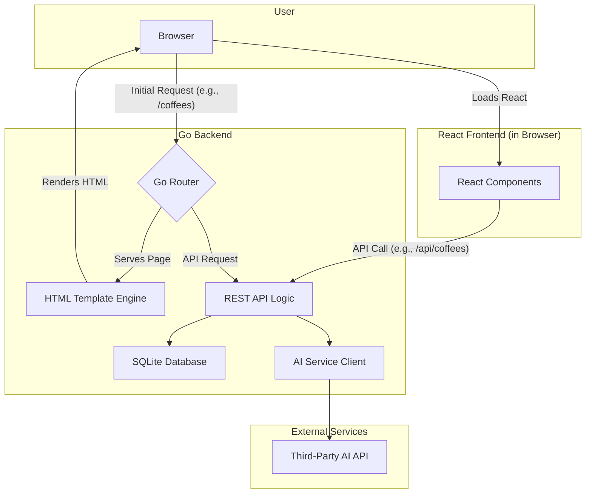

# High Level Architecture

## Technical Summary

The architecture for the Coffeeee app is designed to place most of the complexity on the backend, allowing you to focus on developing your Go skills. We will build a robust, monolithic backend with Go that not only serves a REST API but also handles routing and serves the initial HTML pages. The frontend will be a client-side React application that "hydrates" the server-rendered HTML, managing interactive components without the complexity of a full-blown single-page application's routing and data-fetching logic. This backend-driven approach will provide a solid foundation for the MVP while aligning with your learning goals.

## Repository Structure

We will use a **Monorepo** structure to keep the frontend and backend code together.

*   **Structure:** Monorepo
*   **Monorepo Tool:** `npm workspaces`. This is a simple, built-in solution that is perfect for our needs.
*   **Package Organization:**
    *   `apps/frontend`: The React application.
    *   `apps/backend`: The Go application, which will contain all API logic, routing, and HTML template rendering.
    *   `packages/shared-types`: Shared TypeScript types to ensure consistency between the frontend and backend.

## High Level Architecture Diagram

## Architectural Patterns

*   **Backend-Driven Frontend:** The Go backend will be responsible for routing and serving the initial HTML structure.
    *   *Rationale:* This simplifies the frontend, removing the need for complex client-side routing and data-fetching logic, and allows you to focus on building features in Go.
*   **Monolithic Architecture:** The backend will be a single, unified application.
    *   *Rationale:* This is the simplest and fastest approach for an MVP.
*   **Component-Based UI (with Hydration):** The React frontend will be used to create interactive components that "hydrate" the server-rendered HTML.
    *   *Rationale:* This gives us the benefit of React's component model for building a modern UI, without the complexity of a full single-page application.
*   **Repository Pattern:** The backend will use the repository pattern to abstract data access logic.
    *   *Rationale:* This will keep your business logic clean and make it easier to test and maintain.

---
